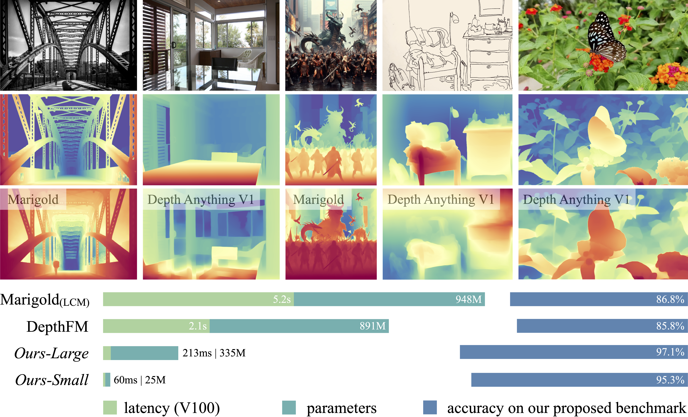

<div align="center">
<h1>Depth Anything V2</h1>

[**Lihe Yang**](https://liheyoung.github.io/)<sup>1</sup> · [**Bingyi Kang**](https://bingykang.github.io/)<sup>2&dagger;</sup> · [**Zilong Huang**](http://speedinghzl.github.io/)<sup>2</sup>
<br>
[**Zhen Zhao**](http://zhaozhen.me/) · [**Xiaogang Xu**](https://xiaogang00.github.io/) · [**Jiashi Feng**](https://sites.google.com/site/jshfeng/)<sup>2</sup> · [**Hengshuang Zhao**](https://hszhao.github.io/)<sup>1*</sup>

<sup>1</sup>HKU&emsp;&emsp;&emsp;<sup>2</sup>TikTok
<br>
&dagger;project lead&emsp;*corresponding author

<a href="https://arxiv.org/abs/2406.09414"></a>
<a href='https://depth-anything-v2.github.io'></a>
<a href='https://huggingface.co/spaces/depth-anything/Depth-Anything-V2'></a>
<a href='https://huggingface.co/datasets/depth-anything/DA-2K'></a>
</div>

This work presents Depth Anything V2. It significantly outperforms [V1](https://github.com/LiheYoung/Depth-Anything) in fine-grained details and robustness. Compared with SD-based models, it enjoys faster inference speed, fewer parameters, and higher depth accuracy.

> **U250 deployment:** this fork includes the fixed-shape 280/518 model
> adapters, calibration and DS-Compiler kernel pipeline, resident DDR linker,
> mapped-buffer runtime, and board gates. Start with
> [docs/U250_REPRODUCIBLE_BUILD.md](docs/U250_REPRODUCIBLE_BUILD.md) and
> `configs/depthanything_u250.example.env`.

## U250 deployment: checkpoint to board

This section is the executable overview for a clean checkout. The deployment
uses Depth Anything V2-Small and supports the two fixed input contracts below.

| Input | Adapter | Patch grid | ViT tokens |
|:-|:-|--:|--:|
| `[1,3,518,518]` | `ds_models.depth_anything_v2_vits` | 37 x 37 | 1370 |
| `[1,3,280,280]` | `ds_models.depth_anything_v2_vits_280` | 20 x 20 | 401 |

The generated U250 image is a resident kernel bank, not one monolithic
`model.bin`:

```text
PyTorch checkpoint
  -> fixed-shape FP32 ONNX + audit
  -> DS quantized ONNX
  -> calibrated kernel ONNX families
  -> DS-Compiler CFG + DDR BIN files
  -> relocated resident DDR bank + runtime contract + host plan
  -> C++ mapped-buffer runtime
  -> free-running U250 accuracy and latency gate
```

Generated checkpoints, calibration tensors, ONNX files, CFG/BIN files and
board evidence are intentionally kept outside Git. The DS toolchain and U250
bitstream must also be supplied separately.

### Dependency contract

There are three distinct environments. Do not mix native Python extensions
from different Python minor versions.

| Environment | Required components | Purpose |
|:-|:-|:-|
| Export/calibration host | Python 3.9 or 3.10, packages pinned in `requirements-u250.txt` | PyTorch export, ONNX audit, NYU/DA-2K calibration |
| DS compile host | DS compiler Python, `ACModelHelper`, ACMLIR/ACPC native libraries, 16/256 architecture YAMLs | Quantization, scheduling and CFG/BIN code generation |
| U250 board host | The same Python ABI as `npz2bin*.so`, C++17 compiler, pybind11, matching bitstream and XDMA devices | Codec qualification, DMA execution and board gates |

Ubuntu/Debian system prerequisites are:

```bash
sudo apt-get update
sudo apt-get install -y \
  git curl ca-certificates build-essential make pkg-config \
  python3 python3-dev python3-venv
```

The Python environment is fully pinned:

```bash
python3 -m venv .venv
source .venv/bin/activate
python -m pip install --upgrade pip setuptools wheel
python -m pip install -r requirements-u250.txt

python - <<'PY'
import cv2, h5py, numpy, onnx, onnxruntime, pybind11, torch, torchvision
print("torch", torch.__version__)
print("torchvision", torchvision.__version__)
print("numpy", numpy.__version__)
print("onnx", onnx.__version__)
print("onnxruntime", onnxruntime.__version__)
print("opencv", cv2.__version__)
print("h5py", h5py.__version__)
print("pybind11", pybind11.__version__)
PY
```

The external compiler installation must have this minimum layout:

```text
$DS_TOOLCHAIN_ROOT/
  python_bin/compile.py
  python_libs/ACModelHelper/
  arch_16_mono.yaml
  arch_256_mono.yaml

$PYTHON_ROOT/
  RelWithDebInfo/lib/          # ACMLIR/ACPC Python/native extensions
```

The board runtime directory must match the programmed bitstream and the Python
ABI used to run inference:

```text
$U250_RUNTIME_DIR/
  npz2bin.cpython-<ABI>-x86_64-linux-gnu.so
  arch_16_mono.yaml
  arch_256_mono.yaml
```

For example, a `cpython-310` `npz2bin` must be loaded by Python 3.10. Check all
native dependencies before compiling or running:

```bash
"$DS_COMPILER_PYTHON" -c \
  'import sys; print(sys.version); import ACModelHelper; print(ACModelHelper.__file__)'

find "$ACOMPILER_EXTENSION_DIR" -maxdepth 1 -name '*.so' -print -exec ldd {} \;
find "$U250_RUNTIME_DIR" -maxdepth 1 -name 'npz2bin*.so' -print -exec ldd {} \;
```

Every `ldd` entry must resolve; any `not found` entry is a hard failure. The DS
toolchain, architecture YAMLs, `npz2bin`, bitstream and generated CFG/BIN files
must come from one compatible release.

The repository supplies the model/runtime source and the NumPy BF16 helper. It
does not redistribute `ACModelHelper`, ACMLIR/ACPC, `npz2bin`, the bitstream or
the XDMA kernel module.

### 0. Environment and checkpoint

```bash
git clone https://github.com/DingdongD/Depthanything_Demo.git
cd Depthanything_Demo

mkdir -p checkpoints
curl -L \
  https://huggingface.co/depth-anything/Depth-Anything-V2-Small/resolve/main/depth_anything_v2_vits.pth \
  -o checkpoints/depth_anything_v2_vits.pth

cp configs/depthanything_u250.example.env /tmp/depthanything_u250.env
# Edit every /opt/... path before sourcing this file.
${EDITOR:-vi} /tmp/depthanything_u250.env
source /tmp/depthanything_u250.env

python tools/check_u250_repro_env.py \
  --output "$DEPTHANYTHING_U250_BUILD_ROOT/environment.json"
```

The environment file defines the checkpoint, DS compiler, architecture YAMLs,
ACMLIR/ACPC build, compiler Python and an external build root. On the board,
add `--require-board` to the environment check after the matching bitstream and
XDMA driver are loaded.

The important environment variables and their ownership are:

| Variable | Required on | Meaning |
|:-|:-|:-|
| `DEPTH_ANYTHING_CHECKPOINT` | export/calibration | Official V2-Small `.pth` |
| `DS_TOOLCHAIN_ROOT` | quantize/compile | DS compiler root and `python_libs` |
| `DS_COMPILER` | compile | `python_bin/compile.py` |
| `DS_COMPILER_PYTHON` | quantize/compile/board | Python executable matching native compiler/runtime modules |
| `DS_ARCH_16`, `DS_ARCH_256` | compile | Architecture descriptions used by code generation |
| `PYTHON_ROOT` | compile | ACMLIR/ACPC build root |
| `ACOMPILER_EXTENSION_DIR` | compile | Native compiler extension directory |
| `DEPTHANYTHING_U250_BUILD_ROOT` | all | External generated-artifact root |
| `U250_RUNTIME_DIR` | board | Vendor `npz2bin` and matching YAMLs |
| `NYU_H5_ROOT` | calibration | Source NYU `.h5` files with an `rgb` dataset |
| `DA2K_DATASET_ROOT` | calibration | DA-2K root containing `annotations.json` and `images/` |
| `DA2K_IMAGE_ROOT` | calibration | `$DA2K_DATASET_ROOT/images`, containing scene directories |
| `DA2K_MANIFEST` | bootstrap calibration | Deterministic DA-2K split manifest generated below |
| `ATTENTION_JPEG_DIR` | bootstrap calibration | Flat directory of disjoint calibration JPGs |

Keep the generated environment report with the build. It records resolved
paths and catches missing repository files, Python modules and compiler inputs.

Select one fixed shape for the rest of the commands:

```bash
export SHAPE=518                    # use 280 for the low-latency graph
export BUILD="$DEPTHANYTHING_U250_BUILD_ROOT/$SHAPE"
mkdir -p "$BUILD/models" "$BUILD/calibration"

if [ "$SHAPE" = 518 ]; then
  export ADAPTER=ds_models.depth_anything_v2_vits
else
  export ADAPTER=ds_models.depth_anything_v2_vits_280
fi
```

### 1. PyTorch to fixed-shape ONNX

```bash
python tools/export_depth_anything_v2_ds.py \
  --adapter-module "$ADAPTER" \
  --output "$BUILD/models/depthanything_fp32.onnx"

python tools/quantize_depth_anything_v2_ds.py \
  --toolchain-root "$DS_TOOLCHAIN_ROOT" \
  --input "$BUILD/models/depthanything_fp32.onnx"

export QUANTIZED_MODEL="$BUILD/models/depthanything_fp32_sc.onnx"
test -s "$QUANTIZED_MODEL"
test -s "$BUILD/models/depthanything_fp32.audit.json"
sha256sum \
  "$BUILD/models/depthanything_fp32.onnx" \
  "$BUILD/models/depthanything_fp32.audit.json" \
  "$QUANTIZED_MODEL"
```

The export audit checks the PyTorch and ONNX Runtime outputs and the static
shape contract. Do not continue on a failed audit, a dynamic tensor, or a
non-finite output.

### 2. Build calibration profiles

First build one immutable NYU+DA-2K set for both supported shapes. NYU files
must be `.h5` files containing an `rgb` dataset shaped `[3,H,W]`. DA-2K uses
its standard `annotations.json` plus `images/<scene>/<image>` layout.

```bash
export UNIFIED_CAL_ROOT="$DEPTHANYTHING_U250_BUILD_ROOT/unified_calibration"

python tools/build_u250_full_graph_calibration_set.py \
  --nyu-root "$NYU_H5_ROOT" \
  --da2k-root "$DA2K_IMAGE_ROOT" \
  --nyu-count 128 \
  --da2k-count 32 \
  --shapes 280,518 \
  --output-root "$UNIFIED_CAL_ROOT"

export CAL_MANIFEST="$UNIFIED_CAL_ROOT/manifest.json"
export NYU_INPUT_ROOT="$UNIFIED_CAL_ROOT/inputs/$SHAPE/nyu"

python tools/prepare_da2k_calibration_manifest.py \
  --dataset-root "$DA2K_DATASET_ROOT" \
  --output "$DA2K_MANIFEST" \
  --calibration-count 512 \
  --tuning-count 128

python tools/prepare_mixed_calibration_inputs.py \
  --nyu-input-root "$NYU_INPUT_ROOT" \
  --nyu-count 128 \
  --da2k-root "$DA2K_DATASET_ROOT" \
  --da2k-manifest "$DA2K_MANIFEST" \
  --da2k-count 32 \
  --size "$SHAPE" \
  --output-dir "$BUILD/calibration/mixed"

# Materialize a flat, deterministic 16-image attention bootstrap directory.
python - "$DA2K_DATASET_ROOT" "$DA2K_MANIFEST" "$ATTENTION_JPEG_DIR" <<'PY'
import json, sys
from pathlib import Path
root, manifest, output = map(Path, sys.argv[1:])
records = json.loads(manifest.read_text())["splits"]["calibration"][:16]
output.mkdir(parents=True, exist_ok=True)
for index, record in enumerate(records):
    target = output / f"{index:04d}.jpg"
    if not target.exists():
        target.symlink_to((root / record["path"]).resolve())
print("attention bootstrap images:", len(records))
PY

python tools/calibrate_a8b8_linears_convs.py profile \
  --model "$BUILD/models/depthanything_fp32.onnx" \
  --input-list "$BUILD/calibration/mixed/calibration_inputs.json" \
  --manifest "$BUILD/calibration/a8_full_graph.json" \
  --scale-objective balanced-mse

# ATTENTION_JPEG_DIR is a flat directory containing at least 16 disjoint JPGs.
python tools/calibrate_static_int8_attention.py \
  --checkpoint "$DEPTH_ANYTHING_CHECKPOINT" \
  --images "$ATTENTION_JPEG_DIR" \
  --input-size "$SHAPE" \
  --calibration-count 12 \
  --validation-count 4 \
  --output "$BUILD/calibration/attention.json"

python tools/calibrate_a8b8_linears_convs.py apply \
  --input "$QUANTIZED_MODEL" \
  --profile "$BUILD/calibration/a8_full_graph.json" \
  --output "$BUILD/models/depthanything_u250_calibrated.onnx"

export MODEL="$BUILD/models/depthanything_u250_calibrated.onnx"
test -s "$MODEL"
test -s "$BUILD/calibration/a8_full_graph.json"
test -s "$BUILD/calibration/attention.json"
```

The same `a8_full_graph.json` is intentionally passed to both the encoder
linear and decoder convolution exporters. Production recalibration must use a
single immutable NYU+DA-2K manifest for all stages; that workflow is shown
after the first board-capable package is built.

### 3. Export and compile all NPU kernels

```bash
python tools/export_u250_base_kernels.py \
  --shape "$SHAPE" \
  --model "$MODEL" \
  --attention-profile "$BUILD/calibration/attention.json" \
  --linear-profile "$BUILD/calibration/a8_full_graph.json" \
  --decoder-profile "$BUILD/calibration/a8_full_graph.json" \
  --output-root "$BUILD/export"

python tools/compile_u250_base_kernels.py \
  --export-root "$BUILD/export" \
  --output-root "$BUILD/compiled" \
  --jobs 8

python - <<'PY'
import json, os
from pathlib import Path
root = Path(os.environ["BUILD"]) / "compiled"
manifest = json.loads((root / "manifest.json").read_text())
assert manifest["kernel_count"] > 0
for family in manifest["families"].values():
    for item in family:
        assert Path(item["cfg"]).stat().st_size
        assert Path(item["binary"]).stat().st_size
print("compiled kernels:", manifest["kernel_count"])
PY
```

The exporter creates patch projection, 12 QKV groups, dual-range/two-chunk
attention, encoder post/MLP and 32 decoder convolution families. The compiler
stage must produce a non-empty `*_cfg.txt`, `*_ddr.bin` and log for every
kernel. Internally, the vendor stack performs these six layers:

1. PyTorch model export to fixed-shape ONNX;
2. ONNX quantization and ONNX/MLIR lowering;
3. ACMoSA graph-IR construction and legalization;
4. ACTuner scheduling and ACPC-IR generation;
5. ACPC code generation to CFG and DDR binaries;
6. NPU runtime loading, DMA dispatch and execution.

For compiler debugging, every family wrapper ultimately invokes the equivalent
of:

```bash
"$DS_COMPILER_PYTHON" "$DS_COMPILER" \
  --model /absolute/path/to/kernel.onnx \
  --output_path /absolute/path/to/output/kernel \
  --log_path /absolute/path/to/output \
  --arch_path "$DS_ARCH_16,$DS_ARCH_256" \
  --layouts input0=BCHW \
  --codegen 2 --sim 1 --addr 1 --l2_size 100 --spill_threshold 0
```

Matrix kernels use `BWC` layouts and the required codegen mode recorded by the
export manifest; use the repository wrappers rather than copying this example
across kernel families.

### 4. Link the resident package

```bash
python tools/package_u250_base.py \
  --model "$MODEL" \
  --export-root "$BUILD/export" \
  --compiled-root "$BUILD/compiled" \
  --output-dir "$BUILD/package"

python - <<'PY'
import json, os
from pathlib import Path
package = Path(os.environ["BUILD"]) / "package"
record = json.loads((package / "package_build_manifest.json").read_text())
assert record["deployment_status"] == "candidate_requires_codec_and_board_gate"
for name, identity in record["files"].items():
    path = package / name
    assert path.stat().st_size == identity["bytes"]
print("package files verified:", len(record["files"]))
PY
```

The package contains the persistent weight/program bank, relocated CFGs,
runtime contract, host/NPU schedule and host constants:

```text
package/depthanything_u250_resident_kernel_bank.bin
package/resident_kernel_bank_manifest.json
package/cfg/
package/depthanything_u250_runtime_contract.json
package/depthanything_u250_host_plan.json
package/depthanything_u250_host_params.npz
package/npz_util.py
package/package_build_manifest.json
```

At this point the package status is
`candidate_requires_codec_and_board_gate`; compilation alone is not board
qualification.

### 5. Build and qualify the C++ runtime on the U250 host

Program the bitstream and load its matching XDMA driver using the vendor board
procedure first. The mapped runtime opens both DMA banks and all 16 interrupt
event nodes, so the following set must exist and be accessible by the runtime
user:

```bash
ls -l \
  /dev/xdma0_user \
  /dev/xdma0_h2c_0 /dev/xdma0_h2c_1 \
  /dev/xdma0_c2h_0 /dev/xdma0_c2h_1 \
  /dev/xdma0_events_{0..15}

python tools/check_u250_repro_env.py \
  --require-board \
  --output "$BUILD/board_environment.json"
```

If the devices exist but are not accessible, fix the deployment user's XDMA
group/udev permissions; do not run the application permanently as root.

```bash
make -f tools/Makefile.u250_runtime \
  dma-batch PYTHON="$DS_COMPILER_PYTHON"

export FPGA_DMA_BATCH=build/native_codec
export FPGA_DMA_BATCH_SO="$(find "$FPGA_DMA_BATCH" -maxdepth 1 -name 'fpgaDmaBatch*.so' -print -quit)"
test -s "$FPGA_DMA_BATCH_SO"

python tools/validate_u250_native_codecs.py \
  --manifest "$BUILD/package/resident_kernel_bank_manifest.json" \
  --cfg-dir "$BUILD/package/cfg" \
  --runtime-dir "$U250_RUNTIME_DIR" \
  --case-dir "$BUILD/package" \
  --extension "$FPGA_DMA_BATCH_SO" \
  --layout ALL \
  --output "$BUILD/package/native_codec_report.json" \
  --work-dir "$BUILD/codec_validation"

python tools/qualify_u250_host_executor.py \
  --fpga-dma-batch "$FPGA_DMA_BATCH" \
  --output "$BUILD/package/host_executor_qualification.json"

python - <<'PY'
import json, os
from pathlib import Path
package = Path(os.environ["BUILD"]) / "package"
for name in ("native_codec_report.json", "host_executor_qualification.json"):
    report = json.loads((package / name).read_text())
    assert report["qualified"], (name, report)
print("native codec and C++ host executor qualified")
PY
```

Both reports are fail-closed and are bound to extension/source hashes. Native
layout conversion or the C++ host executor is enabled only when its report is
qualified.

### 6. Run a resident board campaign

The batch runner acquires one board lock, loads the resident bank once, warms
up once, then measures free-running frames. All defaults with historical local
paths are overridden below.

```bash
export U250_DA_BASE="$PWD"
export U250_RUNTIME_DIR=/absolute/path/to/vendor/runtime
export U250_PYTHON="$DS_COMPILER_PYTHON"
export U250_RUNNER="$PWD/tools/run_u250_depthanything_hybrid.py"
export U250_CONTRACT="$BUILD/package/depthanything_u250_runtime_contract.json"
export U250_CODEC_REPORT="$BUILD/package/native_codec_report.json"
export U250_FPGA_DMA_BATCH="$PWD/build/native_codec"
export U250_HOST_EXECUTOR_REPORT="$BUILD/package/host_executor_qualification.json"
export U250_HOST_PARAMS="$BUILD/package/depthanything_u250_host_params.npz"
export U250_INPUT_ROOT="$BUILD/board_inputs"

bash tools/run_u250_native_resident_latency_batch.sh \
  "$BUILD/package" "$BUILD/board_results" \
  nyu/sample_0001 da2k/scene/sample_0001
```

Sample arguments are paths relative to `U250_INPUT_ROOT`, without `.npy`.
Archive the raw resident-server log, per-sample depth `.npz` files, mean/p95
latency, final-depth metrics, Git commit, bitstream/XDMA identity and hashes of
all generated artifacts.

For a single functional frame before the resident campaign, use the explicit
runner interface:

```bash
python tools/run_u250_depthanything_hybrid.py \
  --case-dir "$BUILD/package" \
  --runtime-dir "$U250_RUNTIME_DIR" \
  --manifest "$BUILD/package/resident_kernel_bank_manifest.json" \
  --contract "$BUILD/package/depthanything_u250_runtime_contract.json" \
  --host-plan "$BUILD/package/depthanything_u250_host_plan.json" \
  --host-params "$BUILD/package/depthanything_u250_host_params.npz" \
  --cfg-dir "$BUILD/package/cfg" \
  --input "$BUILD/board_inputs/nyu/sample_0001.npy" \
  --output "$BUILD/smoke/sample_0001.npz" \
  --depth-only \
  --dma-runtime cpp_mapped \
  --layout-codec native \
  --layout-codec-report "$BUILD/package/native_codec_report.json" \
  --fpga-dma-batch "$PWD/build/native_codec" \
  --host-executor cpp \
  --host-executor-report "$BUILD/package/host_executor_qualification.json" \
  --cpp-persistent-dma
```

### 7. Unified NYU+DA-2K final-depth recalibration

The production/SOTA path does not calibrate blocks one at a time. It freezes
one train/validation identity set, captures all encoder and decoder boundaries
in one pass, proposes every scale/dual-range threshold together, and accepts a
candidate only through a complete free-running final-depth gate.

```bash
# Reuse the exact manifest created in step 2; do not select another sample set.
export UNIFIED_CAL_ROOT="$DEPTHANYTHING_U250_BUILD_ROOT/unified_calibration"
export CAL_MANIFEST="$UNIFIED_CAL_ROOT/manifest.json"
test -s "$CAL_MANIFEST"

python tools/collect_fp32_replacement_traces.py \
  --sample-manifest "$CAL_MANIFEST" \
  --manifest-shape "$SHAPE" \
  --checkpoint "$DEPTH_ANYTHING_CHECKPOINT" \
  --host-plan "$BUILD/package/depthanything_u250_host_plan.json" \
  --compact-calibration \
  --output-root "$BUILD/joint/traces"

python tools/calibrate_u250_full_graph_joint.py fit \
  --manifest "$CAL_MANIFEST" \
  --shape "$SHAPE" \
  --trace-root "$BUILD/joint/traces" \
  --contract "$BUILD/package/depthanything_u250_runtime_contract.json" \
  --host-plan "$BUILD/package/depthanything_u250_host_plan.json" \
  --output-dir "$BUILD/joint/proposal"
```

Export, compile and assemble every changed kernel:

```bash
if [ "$SHAPE" = 518 ]; then export TOKENS=1370; else export TOKENS=401; fi

export BASE_PACKAGE="$BUILD/package"
export PROPOSAL="$BUILD/joint/proposal"
export CANDIDATE_EXPORT="$BUILD/joint/candidate_export"
export CANDIDATE_COMPILED="$BUILD/joint/candidate_compiled"
export CANDIDATE_PACKAGE="$BUILD/joint/candidate_package"

python tools/export_u250_full_graph_joint_candidate.py \
  --base-contract "$BASE_PACKAGE/depthanything_u250_runtime_contract.json" \
  --proposed-contract "$PROPOSAL/proposed_runtime_contract.json" \
  --base-host-plan "$BASE_PACKAGE/depthanything_u250_host_plan.json" \
  --proposed-host-plan "$PROPOSAL/proposed_host_plan.json" \
  --qkv-root "$BUILD/export/qkv" \
  --encoder-tail-root "$BUILD/export/encoder_tail" \
  --fc1-root "$BUILD/export/encoder_tail" \
  --decoder-root "$BUILD/export/decoder" \
  --tokens "$TOKENS" \
  --output-root "$CANDIDATE_EXPORT"

python tools/compile_u250_full_graph_joint.py \
  --manifest "$CANDIDATE_EXPORT/manifest.json" \
  --output-root "$CANDIDATE_COMPILED" \
  --jobs 8

python tools/assemble_u250_full_graph_joint_package.py \
  --base-package "$BASE_PACKAGE" \
  --compiled-manifest "$CANDIDATE_COMPILED/manifest.json" \
  --proposed-contract "$PROPOSAL/proposed_runtime_contract.json" \
  --proposed-host-plan "$PROPOSAL/proposed_host_plan.json" \
  --calibration-report "$PROPOSAL/joint_calibration_report.json" \
  --calibration-manifest "$CAL_MANIFEST" \
  --source-codec-report "$BASE_PACKAGE/native_codec_report.json" \
  --output-package "$CANDIDATE_PACKAGE"
```

The replacement package preserves resident addresses and tensor ABI. If the
proposal contains `attention6_*` replacements, `BASE_PACKAGE` must already be
the qualified fused-attention package containing those kernel names. The
assembler deliberately rejects a two-chunk bootstrap bank or any size/tensor/
instruction ABI mismatch; do not bypass that check.

Run the baseline and candidate packages over every identity in the frozen
manifest. The compact FP32 traces already contain the matching final-depth
reference.

```bash
mapfile -t CAL_SAMPLES < <(
  python - "$CAL_MANIFEST" "$SHAPE" <<'PY'
import json, sys
manifest = json.load(open(sys.argv[1]))
shape = sys.argv[2]
for sample in manifest["samples"]:
    if shape in sample["tensors"]:
        print(sample["sample_id"])
PY
)

export U250_INPUT_ROOT="$UNIFIED_CAL_ROOT/inputs/$SHAPE"

run_joint_package() {
  local package=$1 output=$2 codec
  codec="$package/native_codec_report_active.json"
  if [ ! -f "$codec" ]; then codec="$package/native_codec_report.json"; fi
  U250_CONTRACT="$package/depthanything_u250_runtime_contract.json" \
  U250_CODEC_REPORT="$codec" \
  U250_HOST_PARAMS="$package/depthanything_u250_host_params.npz" \
    bash tools/run_u250_native_resident_latency_batch.sh \
      "$package" "$output" "${CAL_SAMPLES[@]}"
}

run_joint_package "$BASE_PACKAGE" "$BUILD/joint/baseline"
run_joint_package "$CANDIDATE_PACKAGE" "$BUILD/joint/candidate"
```

Finally gate the free-running final-depth outputs:

```bash
python tools/calibrate_u250_full_graph_joint.py gate \
  --manifest "$CAL_MANIFEST" \
  --shape "$SHAPE" \
  --calibration "$BUILD/joint/proposal/joint_calibration_report.json" \
  --reference-root "$BUILD/joint/traces" \
  --baseline-root "$BUILD/joint/baseline" \
  --candidate-root "$BUILD/joint/candidate" \
  --regression-tolerance 0 \
  --output "$BUILD/joint/final_depth_gate.json"
```

Only a candidate whose gate reports `accepted: true` is eligible to replace a
qualified package. No empirical attention/context output gain is part of this
workflow.

### Failure map

| Failure | Meaning and action |
|:-|:-|
| `No module named ACModelHelper` | `DS_TOOLCHAIN_ROOT/python_libs` is missing or the wrong DS release is selected. Use `quantize_depth_anything_v2_ds.py`; it inserts this path explicitly. |
| `ImportError` / `undefined symbol` from a `.so` | Python minor ABI, libstdc++/glibc, ACMLIR/ACPC or `npz2bin` mismatch. Compare the SO suffix and inspect every dependency with `ldd`. |
| Compiler exits without non-empty CFG/BIN | Inspect that kernel's `compile.log`; do not package partial output. Confirm both architecture YAMLs and `ACOMPILER_EXTENSION_DIR`. |
| Missing `/dev/xdma0_h2c_1`, `c2h_1` or event nodes | Wrong/incomplete XDMA driver load for this runtime. Reload the matching driver/bitstream before retrying. |
| Native codec report is rejected | CFG, resident manifest, extension or YAML hash changed. Re-run codec qualification for the exact package and extension. |
| Resident replacement ABI mismatch | Candidate kernel size, tensors, addresses or instruction ranges do not fit the base bank. Rebuild from a compatible fused base; never force the replacement. |
| NPU timeout | Stop the campaign, preserve the failing CFG/input/log, verify bitstream/toolchain identity and run the smallest kernel probe before full-graph retry. |
| Accuracy gate rejects a candidate | Keep the previous qualified package. Inspect per-domain final-depth and capture-and-replace evidence; do not add an empirical output gain. |

All exporters that require an empty destination fail closed. Use a new
versioned build directory for a new model/toolchain/calibration identity rather
than mixing files from different runs.

For artifact schemas, lower-level commands and evidence requirements, read
[the complete U250 reproduction guide](docs/U250_REPRODUCIBLE_BUILD.md).




## News
- **2025-01-22:** [Video Depth Anything](https://videodepthanything.github.io) has been released. It generates consistent depth maps for super-long videos (e.g., over 5 minutes).
- **2024-12-22:** [Prompt Depth Anything](https://promptda.github.io/) has been released. It supports 4K resolution metric depth estimation when low-res LiDAR is used to prompt the DA models.
- **2024-07-06:** Depth Anything V2 is supported in [Transformers](https://github.com/huggingface/transformers/). See the [instructions](https://huggingface.co/docs/transformers/main/en/model_doc/depth_anything_v2) for convenient usage.
- **2024-06-25:** Depth Anything is integrated into [Apple Core ML Models](https://developer.apple.com/machine-learning/models/). See the instructions ([V1](https://huggingface.co/apple/coreml-depth-anything-small), [V2](https://huggingface.co/apple/coreml-depth-anything-v2-small)) for usage.
- **2024-06-22:** We release [smaller metric depth models](https://github.com/DepthAnything/Depth-Anything-V2/tree/main/metric_depth#pre-trained-models) based on Depth-Anything-V2-Small and Base.
- **2024-06-20:** Our repository and project page are flagged by GitHub and removed from the public for 6 days. Sorry for the inconvenience.
- **2024-06-14:** Paper, project page, code, models, demo, and benchmark are all released.


## Pre-trained Models

We provide **four models** of varying scales for robust relative depth estimation:

| Model | Params | Checkpoint |
|:-|-:|:-:|
| Depth-Anything-V2-Small | 24.8M | [Download](https://huggingface.co/depth-anything/Depth-Anything-V2-Small/resolve/main/depth_anything_v2_vits.pth?download=true) |
| Depth-Anything-V2-Base | 97.5M | [Download](https://huggingface.co/depth-anything/Depth-Anything-V2-Base/resolve/main/depth_anything_v2_vitb.pth?download=true) |
| Depth-Anything-V2-Large | 335.3M | [Download](https://huggingface.co/depth-anything/Depth-Anything-V2-Large/resolve/main/depth_anything_v2_vitl.pth?download=true) |
| Depth-Anything-V2-Giant | 1.3B | Coming soon |


## Usage

### Prepraration

```bash
git clone https://github.com/DepthAnything/Depth-Anything-V2
cd Depth-Anything-V2
pip install -r requirements.txt
```

Download the checkpoints listed [here](#pre-trained-models) and put them under the `checkpoints` directory.

### Use our models
```python
import cv2
import torch

from depth_anything_v2.dpt import DepthAnythingV2

DEVICE = 'cuda' if torch.cuda.is_available() else 'mps' if torch.backends.mps.is_available() else 'cpu'

model_configs = {
    'vits': {'encoder': 'vits', 'features': 64, 'out_channels': [48, 96, 192, 384]},
    'vitb': {'encoder': 'vitb', 'features': 128, 'out_channels': [96, 192, 384, 768]},
    'vitl': {'encoder': 'vitl', 'features': 256, 'out_channels': [256, 512, 1024, 1024]},
    'vitg': {'encoder': 'vitg', 'features': 384, 'out_channels': [1536, 1536, 1536, 1536]}
}

encoder = 'vitl' # or 'vits', 'vitb', 'vitg'

model = DepthAnythingV2(**model_configs[encoder])
model.load_state_dict(torch.load(f'checkpoints/depth_anything_v2_{encoder}.pth', map_location='cpu'))
model = model.to(DEVICE).eval()

raw_img = cv2.imread('your/image/path')
depth = model.infer_image(raw_img) # HxW raw depth map in numpy
```

If you do not want to clone this repository, you can also load our models through [Transformers](https://github.com/huggingface/transformers/). Below is a simple code snippet. Please refer to the [official page](https://huggingface.co/docs/transformers/main/en/model_doc/depth_anything_v2) for more details.

- Note 1: Make sure you can connect to Hugging Face and have installed the latest Transformers.
- Note 2: Due to the [upsampling difference](https://github.com/huggingface/transformers/pull/31522#issuecomment-2184123463) between OpenCV (we used) and Pillow (HF used), predictions may differ slightly. So you are more recommended to use our models through the way introduced above.
```python
from transformers import pipeline
from PIL import Image

pipe = pipeline(task="depth-estimation", model="depth-anything/Depth-Anything-V2-Small-hf")
image = Image.open('your/image/path')
depth = pipe(image)["depth"]
```

### Running script on *images*

```bash
python run.py \
  --encoder <vits | vitb | vitl | vitg> \
  --img-path <path> --outdir <outdir> \
  [--input-size <size>] [--pred-only] [--grayscale]
```
Options:
- `--img-path`: You can either 1) point it to an image directory storing all interested images, 2) point it to a single image, or 3) point it to a text file storing all image paths.
- `--input-size` (optional): By default, we use input size `518` for model inference. ***You can increase the size for even more fine-grained results.***
- `--pred-only` (optional): Only save the predicted depth map, without raw image.
- `--grayscale` (optional): Save the grayscale depth map, without applying color palette.

For example:
```bash
python run.py --encoder vitl --img-path assets/examples --outdir depth_vis
```

### Running script on *videos*

```bash
python run_video.py \
  --encoder <vits | vitb | vitl | vitg> \
  --video-path assets/examples_video --outdir video_depth_vis \
  [--input-size <size>] [--pred-only] [--grayscale]
```

***Our larger model has better temporal consistency on videos.***

### Gradio demo

To use our gradio demo locally:

```bash
python app.py
```

You can also try our [online demo](https://huggingface.co/spaces/Depth-Anything/Depth-Anything-V2).

***Note: Compared to V1, we have made a minor modification to the DINOv2-DPT architecture (originating from this [issue](https://github.com/LiheYoung/Depth-Anything/issues/81)).*** In V1, we *unintentionally* used features from the last four layers of DINOv2 for decoding. In V2, we use [intermediate features](https://github.com/DepthAnything/Depth-Anything-V2/blob/2cbc36a8ce2cec41d38ee51153f112e87c8e42d8/depth_anything_v2/dpt.py#L164-L169) instead. Although this modification did not improve details or accuracy, we decided to follow this common practice.


## Fine-tuned to Metric Depth Estimation

Please refer to [metric depth estimation](./metric_depth).


## DA-2K Evaluation Benchmark

Please refer to [DA-2K benchmark](./DA-2K.md).


## Community Support

**We sincerely appreciate all the community support for our Depth Anything series. Thank you a lot!**

- Apple Core ML:
    - https://developer.apple.com/machine-learning/models
    - https://huggingface.co/apple/coreml-depth-anything-v2-small
    - https://huggingface.co/apple/coreml-depth-anything-small
- Transformers:
    - https://huggingface.co/docs/transformers/main/en/model_doc/depth_anything_v2
    - https://huggingface.co/docs/transformers/main/en/model_doc/depth_anything
- TensorRT:
    - https://github.com/spacewalk01/depth-anything-tensorrt
    - https://github.com/zhujiajian98/Depth-Anythingv2-TensorRT-python
- ONNX: https://github.com/fabio-sim/Depth-Anything-ONNX
- ComfyUI: https://github.com/kijai/ComfyUI-DepthAnythingV2
- Transformers.js (real-time depth in web): https://huggingface.co/spaces/Xenova/webgpu-realtime-depth-estimation
- Android:
  - https://github.com/shubham0204/Depth-Anything-Android
  - https://github.com/FeiGeChuanShu/ncnn-android-depth_anything


## Acknowledgement

We are sincerely grateful to the awesome Hugging Face team ([@Pedro Cuenca](https://huggingface.co/pcuenq), [@Niels Rogge](https://huggingface.co/nielsr), [@Merve Noyan](https://huggingface.co/merve), [@Amy Roberts](https://huggingface.co/amyeroberts), et al.) for their huge efforts in supporting our models in Transformers and Apple Core ML.

We also thank the [DINOv2](https://github.com/facebookresearch/dinov2) team for contributing such impressive models to our community.


## LICENSE

Depth-Anything-V2-Small model is under the Apache-2.0 license. Depth-Anything-V2-Base/Large/Giant models are under the CC-BY-NC-4.0 license.


## Citation

If you find this project useful, please consider citing:

```bibtex
@article{depth_anything_v2,
  title={Depth Anything V2},
  author={Yang, Lihe and Kang, Bingyi and Huang, Zilong and Zhao, Zhen and Xu, Xiaogang and Feng, Jiashi and Zhao, Hengshuang},
  journal={arXiv:2406.09414},
  year={2024}
}

@inproceedings{depth_anything_v1,
  title={Depth Anything: Unleashing the Power of Large-Scale Unlabeled Data}, 
  author={Yang, Lihe and Kang, Bingyi and Huang, Zilong and Xu, Xiaogang and Feng, Jiashi and Zhao, Hengshuang},
  booktitle={CVPR},
  year={2024}
}
```
